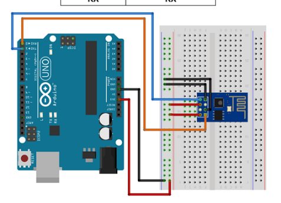

# Arduino Web Socket

## 목표

- 아두이노로 웹 소켓 클라이언트를 구현해보자!
- asdasdasd

## 준비물

- 아두이노 우노 R4
- esp8266

## Reference

- [https://rasino.tistory.com/297](https://rasino.tistory.com/297)
- [https://crystalcube.co.kr/215](https://crystalcube.co.kr/215)

## 세부 분할

### ESP8266 Firmware Update

- 위 레퍼런스를 참조했다. 이때까지만 해도 AT Command가 뭔지 몰랐고, 코드로 명령어를 입력해두면 자동으로 시리얼 모니터에 응답이 나올거라 생각했다.
- 왜냐면 정석적으로 아두이노로 코드 짜보는거는 이번이 처음이였다.

**ESP 모듈 공장 초기화**

- 삽질을 꽤 많이 했다. 왜 펌웨어 업데이트를 해야하는지는 알겠는데 꼭 해야하나 싶었다.. 포기하고 알게된건 AT-Command를 더 잘 사용할 수 있다 정도였다.
    
    
    
- 위 그림처럼 우노 보드와 연결하고 공장 초기화를 진행했다.
    
    
    
    - [https://crystalcube.co.kr/215](https://crystalcube.co.kr/215)
    - 위 사이트에서 하란대로 어찌저찌 펌웨어를 업데이트하는데까지도 성공했다

### AT Command?

"Attention"의 약자로, 모뎀이나 통신 장비와 통신하는 데 사용되는 명령어 라고 한다.

AT Command를 통해서 와이파이 상태나 설정 등을 할 수 있다고 한다. 그래서 정리를 좀 해봤다.

- AT Command 모음
    - **AT+GMR**
        - ESP8266모듈 버전 확인
    - **AT+CWMODE**
        - WIFI모드 확인 및 설정 명령
        - **AT+CWMODE?**
            - 현재 WIFI모드 확인
        - **AT+CWMODE=<1or2or3>**
            - 1 : Station Mode : AP에 접속할 수 있는 기기로 설정
            - 2 : AP Mode : 공유기 기능으로 설정
            - 3 : AP + Station Mode : 접속기기 + AP, 복합 모드 설정
    - AT+CWLAP
        - 주변의 AP 리스트 출력
    - AT+CWJAP=”ssid”,”password”
        - 특정 AP에 연결
        - ssid랑 pw 사이 공백 없어야함
        - 5GHz 안됨
    - AT+CWJAP?
        - 연결된 AP 확인
    - AT+CWQAP
        - AP 접속 해제 명령
    - AT+CIFSR
        - **할당받은 IP 주소 확인**
    - AT+CIPSTATUS
        - TCP/IP 연결 상태 확인
        - 만약 STATUS:2면 IP 주소를 획득한 상태
    - AT+CIPSTART=종류,주소,포트
        - TCP/UDP 연결
            
            
            
    - AT+CWLIF
        - 모듈의 SoftAP에 접속된 station 리스트 보여줌
    - AT+CWDHCP
        - DHCP 활성 / 비활성 설정(AP mode)
    - AT+CIPSTAMAC
        - Station Mode의 MAC 주소 설정(Station mode)
    - AT+CIPAPMAC
        - AP mode의 MAC주소 설정(AP Mode)
    - AT+CIPSTA
        - Station Mode의 IP주소를 고정(고정 IP)
        - `AT+CIPSTA="ip","gateway","netmask"`
    - AT+CIPAP
        - AP Mode의 IP주소를 설정
    - AT+RST
        - 리셋
    - AT+RESTORE
        - 설정 초기화

### Wifi 연결

- AT Command를 사용해서 와이파이 연결은 무난하게 성공했었다.
    
    `AT+CWMODE=1`
    `AT+CWJAP=”ssid”,”password”`
    가 끝이였다.
    

### ? 그래서 이제 뭐해야해?

- 3일정도 GPT와 구글링을 계속 했다. 결국 알아냈던건 아두이노 우노 보드에서 웹 소켓을 하려면 esp8266에서 웹 서버와 통신을 한 뒤 받아온 데이터를 다시 아두이노에 보내줘야 한다는 점이다.(확실하진 않음)

### ???: 에헤이 조졌네 이거

- 그럼 이제 어떡하지?
    
    디바이스마트에서 모터 드라이버, RFID, 스위치 등등 사면서 아두이노 우노 R4-Wifi가 새로 나왔대서 주문 해봤다. 아무래도 데스크 모듈에 핀이 부족하겠다 싶어서 이참에 우노 보드를 바꾸고 되면 대박일테니 하면서 주문한게 마침 도착했다. 이걸로라도 해봐야 겠다 싶었다.
    
    
    

### 아두이노 우노 R4-WiFi로 GET 먼저 해볼까?

아두이노 우노 R4-Wifi는 `ESP32-S3-MINI-1-N8`를 Wi-Fi, Bluewtooth 통신 모듈로 사용하고 있다고 한다. 실제로 연결하고 보드를 업데이트 해보니 여러 예제가 있었다.


- **Web Socket Client**…없네….. WiFiWebClient라도 해봐야겠다 싶어서 해당 코드를 수정했다.
    
    ```cpp
    #include <WiFiS3.h>
    #include "arduino_secrets.h"
    
    // WiFiWebClient //
    
    ///////please enter your sensitive data in the Secret tab/arduino_secrets.h
    char ssid[] = SECRET_SSID;        // your network SSID (name)
    char pass[] = SECRET_PASS;    // your network password (use for WPA, or use as key for WEP)
    int keyIndex = 0;            // your network key index number (needed only for WEP)
    
    int status = WL_IDLE_STATUS;
    char server[] = "192.168.171.2";    // WebSocket server address
    
    WiFiClient wifiClient;
    
    /* -------------------------------------------------------------------------- */
    void setup() {
    /* -------------------------------------------------------------------------- */
      // Initialize serial and wait for port to open:
      Serial.begin(9600);
      while (!Serial) {
        ; // wait for serial port to connect. Needed for native USB port only
      }
    
      // Check for the WiFi module:
      if (WiFi.status() == WL_NO_MODULE) {
        Serial.println("Communication with WiFi module failed!");
        // Don't continue
        while (true);
      }
    
      String fv = WiFi.firmwareVersion();
      if (fv < WIFI_FIRMWARE_LATEST_VERSION) {
        Serial.println("Please upgrade the firmware");
      }
    
      // Attempt to connect to WiFi network:
      while (status != WL_CONNECTED) {
        Serial.print("Attempting to connect to SSID: ");
        Serial.println(ssid);
        // Connect to WPA/WPA2 network. Change this line if using open or WEP network:
        status = WiFi.begin(ssid, pass);
    
        // Wait 10 seconds for connection:
        delay(10000);
      }
    
      printWifiStatus();
    
      Serial.println("\nStarting connection to server...");
      // if you get a connection, report back via serial:
      if (wifiClient.connect("server", 8080)) {
        Serial.println("connected to server");
        // Make a HTTP request:
        // wifiClient.println("GET /tables/list/ HTTP/1.1");
        wifiClient.println("GET / HTTP/1.1");
        wifiClient.println("Host: 192.168.171.2");
        wifiClient.println("Connection: close");
        wifiClient.println();
      }
    }
    
    /* just wrap the received data up to 80 columns in the serial print*/
    /* -------------------------------------------------------------------------- */
    void read_response() {
    /* -------------------------------------------------------------------------- */  
      uint32_t received_data_num = 0;
      while (wifiClient.available()) {
        /* actual data reception */
        char c = wifiClient.read();
        /* print data to serial port */
        Serial.print(c);
        /* wrap data to 80 columns*/
        received_data_num++;
        if(received_data_num % 80 == 0) { 
          Serial.println();
        }
      }  
    }
    
    /* -------------------------------------------------------------------------- */
    void loop() {
    /* -------------------------------------------------------------------------- */
      // Maintain the WebSocket connection
      read_response();
    
      // if the server's disconnected, stop the client:
      if (!wifiClient.connected()) {
        Serial.println();
        Serial.println("disconnecting from server.");
        wifiClient.stop();
    
        // do nothing forevermore:
        while (true);
      }
    }
    
    /* -------------------------------------------------------------------------- */
    void printWifiStatus() {
    /* -------------------------------------------------------------------------- */
      // Print the SSID of the network you're attached to:
      Serial.print("SSID: ");
      Serial.println(WiFi.SSID());
    
      // Print your board's IP address:
      IPAddress ip = WiFi.localIP();
      Serial.print("IP Address: ");
      Serial.println(ip);
    
      // Print the received signal strength:
      long rssi = WiFi.RSSI();
      Serial.print("Signal strength (RSSI):");
      Serial.print(rssi);
      Serial.println(" dBm");
    }
    ```
    
- 만약 Web Socket을 결국 못하면 1분에 한번 데이터를 서버로 보내고 받아 오는 작업을 해야 하니 테스트로 받아올 장고 RESTful API 서버를 만들었다.
    
    
    
- 잘 돌아간다!
    
    ```cpp
    11:04:19.652 -> Content-Type: application/json
    11:04:19.768 -> Vary: Accept, Cookie
    11:04:19.768 -> Allow: POST, 
    11:04:19.768 -> OPTIONS, GET
    11:04:19.768 -> X-Frame-Options: DENY
    11:04:19.768 -> Content-Length: 104
    11:04:19.768 -> X-Content-Type-Options
    11:04:19.893 -> : nosniff
    11:04:19.893 -> Referrer-Policy: same-origin
    11:04:19.893 -> 
    11:04:19.893 -> [{"id":1,"name":"JunSeop"},{"id":2,"n
    11:04:19.893 -> ame":"YeRi"},{"id":3,"name":"HwaYeong"},{"id":4,"name":"Hwayeong"}]
    11:04:19.970 -> disconnecting from server.
    ```
    
    - JSON 데이터를 잘 받아왔으니 이제 파싱해서 데이터를 DP에 저장하면 되겠네! 가 아니고 웹 소켓 뚫어야지ㅋㅋㅋㅋ

### 라이브러리? 그먼…?

- 아두이노는 기본적으로 가지고 있는 예제(표준 라이브러리) 말고, 다른사람이 만들어둔 라이브러리(사용자 커스텀 라이브러리)를 참조해서 개발이 가능하다. **그럼 웹 소켓 클라이언트를 구현해둔 라이브러리를 찾아서 참조하면 가능하겠네?**

### 웨 다 ESP임?

- 여러 라이브러리들을 찾아보면서 문제가 있다는 걸 알았다. 대부분의 커스텀 라이브러리들은 esp 모듈을 기반으로 하기 때문에 ‘아두이노 우노’에서 사용하는 예제가 담긴 라이브러리가 필요했다.
- **[ArduinoWebsockets](https://github.com/gilmaimon/ArduinoWebsockets)**
- **[arduinoWebSockets](https://github.com/Links2004/arduinoWebSockets)**
- **[ArduinoHttpClient](https://github.com/arduino-libraries/ArduinoHttpClient)**
- 위 3개 라이브러리들을 순서대로 사용해보았다. 먼저 ArduinoWebsockets는 컴파일부터 안되길래 빠르게 포기했다.

### arduinoWebSockets

- `const socket = new WebSocket('ws://192.168.171.2:8080');`를 콘솔에서 실행하면 서버에서는 연결되었다는 말이 뜬다. 근데 해당 라이브러리에서 제공하는 코드의 핸드셰이크 부분이 계속 막혀있었다(연결되었다는 말이 안뜬다).
- server.js
    
    ```jsx
    const WebSocket = require('ws');
    
    // 웹 소켓 서버 생성
    const wss = new WebSocket.Server({ host: '0.0.0.0', port: 8080 });
    let cnt = 0;
    // 허용할 클라이언트 IP 주소들을 배열로 정의합니다.
    const allowedIPs = ['127.0.0.1', '192.168.171.72', '192.168.171.2', '192.168.171.151'];
    
    // 클라이언트가 연결되었을 때 처리
    wss.on('connection', (ws, req) => {
      // 클라이언트의 IP 주소를 가져옵니다.
      const clientIP = req.socket.remoteAddress;
    
      // 허용되지 않은 IP 주소라면 연결을 종료합니다.
      if (!allowedIPs.includes(clientIP)) {
        console.log(`클라이언트 ${clientIP}의 연결이 거부되었습니다.`);
        ws.terminate(); // 연결 종료
        return;
      }
    
      console.log(`클라이언트 ${clientIP}가 연결되었습니다.`);
    
      // 클라이언트로부터 메시지를 받았을 때 처리
      ws.on('message', (message) => {
        console.log(`받은 메시지(${clientIP}):`, message.toString());
    
        // 클라이언트에게 메시지 전송
        ws.send('서버가 받았습니다.' + cnt);
        cnt++;
      });
    
      // 클라이언트와 연결이 끊겼을 때 처리
      ws.on('close', () => {
        console.log(`클라이언트 ${clientIP}와의 연결이 끊겼습니다.`);
      });
    });
    ```
    
- 아두이노 WebSocketClient코드
    
    ```cpp
    #include <WiFiS3.h>
    #include <WebSocketsClient.h>
    #include "arduino_secrets.h"
    
    ///////please enter your sensitive data in the Secret tab/arduino_secrets.h
    char ssid[] = SECRET_SSID;        // your network SSID (name)
    char pass[] = SECRET_PASS;    // your network password (use for WPA, or use as key for WEP)
    int keyIndex = 0;            // your network key index number (needed only for WEP)
    
    int status = WL_IDLE_STATUS;
    char server[] = "192.168.171.2";    // WebSocket server address
    int port = 8080;
    
    WiFiClient wifiClient;
    WebSocketsClient webSocket;
    
    /* -------------------------------------------------------------------------- */
    void setup() {
    /* -------------------------------------------------------------------------- */
      // Initialize serial and wait for port to open:
      Serial.begin(9600);
    
      wifiInit();
    
      // Attempt to connect to WiFi network:
      while (status != WL_CONNECTED) {
        Serial.print("Attempting to connect to SSID: ");
        Serial.println(ssid);
        // Connect to WPA/WPA2 network. Change this line if using open or WEP network:
        status = WiFi.begin(ssid, pass);
        
        delay(3000);
      }
      Serial.println("Connected to WIFI");
    
      printWifiStatus();
    
      // Connect to the WebSocket server
      // webSocket.begin("echo.websocket.org", 80, "/");
      webSocket.begin("192.168.171.2", 8080, "/");
      delay(3000);
      // Set up event handler for WebSocket events
      webSocket.onEvent(webSocketEvent);
    }
    
    /* -------------------------------------------------------------------------- */
    void loop() {
    /* -------------------------------------------------------------------------- */
      // Maintain the WebSocket connection
      webSocket.loop();
    }
    
    /* -------------------------------------------------------------------------- */
    void webSocketEvent(WStype_t type, uint8_t *payload, size_t length) {
    /* -------------------------------------------------------------------------- */
      switch (type) {
        case WStype_DISCONNECTED:
          Serial.println("Disconnected from WebSocket server");
          break;
        case WStype_CONNECTED:
          Serial.println("Connected to WebSocket server");
          webSocket.sendTXT("7603");
          break;
        case WStype_TEXT:
          // Handle incoming text data from the WebSocket server
          Serial.print("Received data: ");
          for (size_t i = 0; i < length; i++) {
            Serial.print((char)payload[i]);
          }
          Serial.println();
          break;
      }
    }
    
    /* -------------------------------------------------------------------------- */
    void printWifiStatus() {
    /* -------------------------------------------------------------------------- */
      // Print the SSID of the network you're attached to:
      Serial.print("SSID: ");
      Serial.println(WiFi.SSID());
    
      // Print your board's IP address:
      IPAddress ip = WiFi.localIP();
      Serial.print("IP Address: ");
      Serial.println(ip);
    
      // Print the received signal strength:
      long rssi = WiFi.RSSI();
      Serial.print("Signal strength (RSSI):");
      Serial.print(rssi);
      Serial.println(" dBm");
    }
    
    void wifiInit(){
      while (!Serial) {
        ; // wait for serial port to connect. Needed for native USB port only
      }
    
      // Check for the WiFi module:
      if (WiFi.status() == WL_NO_MODULE) {
        Serial.println("Communication with WiFi module failed!");
        // Don't continue
        while (true);
      }
    
      String fv = WiFi.firmwareVersion();
      if (fv < WIFI_FIRMWARE_LATEST_VERSION) {
        Serial.println("Please upgrade the firmware");
      }
    
    }
    ```
    
    - 41번째 줄에 `webSocket.begin("192.168.171.2", 8080, "/");` 코드가 문제일거라 생각해서 해당 함수를 담고있는 라이브러리를 또 찾아갔다.
    
    ```jsx
    void WebSocketsClient::begin(const char * host, uint16_t port, const char * url, const char * protocol) {
        _host = host;
        _port = port;
    #if defined(HAS_SSL)
        _fingerprint = SSL_FINGERPRINT_NULL;
        _CA_cert     = NULL;
    #endif
    
        _client.num    = 0;
        _client.status = WSC_NOT_CONNECTED;
        _client.tcp    = NULL;
    #if defined(HAS_SSL)
        _client.isSSL = false;
        _client.ssl   = NULL;
    #endif
        _client.cUrl                = url;
        _client.cCode               = 0;
        _client.cIsUpgrade          = false;
        _client.cIsWebsocket        = true;
        _client.cKey                = "";
        _client.cAccept             = "";
        _client.cProtocol           = protocol;
        _client.cExtensions         = "";
        _client.cVersion            = 0;
        _client.base64Authorization = "";
        _client.plainAuthorization  = "";
        _client.isSocketIO          = false;
    
        _client.lastPing         = 0;
        _client.pongReceived     = false;
        _client.pongTimeoutCount = 0;
    
    #ifdef ESP8266
        randomSeed(RANDOM_REG32);
    #elif defined(ARDUINO_ARCH_RP2040)
        randomSeed(rp2040.hwrand32());
    #else
        // todo find better seed
        randomSeed(millis());
    #endif
    #if(WEBSOCKETS_NETWORK_TYPE == NETWORK_ESP8266_ASYNC)
        asyncConnect();
    #endif
    
        _lastConnectionFail = 0;
        _lastHeaderSent     = 0;
    
        DEBUG_WEBSOCKETS("[WS-Client] Websocket Version: " WEBSOCKETS_VERSION "\n");
    }
    ```
    
    - 해당 begin 함수를 WebSocketsClient.cpp 파일에서 찾아 냈다. 근데..esp8266이란다…내 우노는 esp32를 쓰기 때문에 해당 라이브러리를 참조해서 성공시키려면 라이브러리를 수정하는 방법밖에 없나 싶었다.
- **ArduinoHttpClient**
    - 라이브러리 이름부터 이렇게 되어있었어서 처음에는 웹 소켓이 아닌 REST API만 다루는 라이브러리라고 생각했다
    - socket이라고 검색했는데 계속 뜨길래 얘는 도대체 뭐하는 애지? 하고 한번 읽어봤다.
        
        This library can be used for HTTP (GET, POST, PUT, DELETE) requests to a web server. It also supports exchanging messages with WebSocket servers.
        
        - 오,,,? 되는건가? 싶어서 바로 다운받고 wifi 설정한 뒤 실행시켜 보았다
    
    ```jsx
    // SimpleWebSocketClient
    /*
      Simple WebSocket client for ArduinoHttpClient library
      Connects to the WebSocket server, and sends a hello
      message every 5 seconds
    
      created 28 Jun 2016
      by Sandeep Mistry
      modified 22 Jan 2019
      by Tom Igoe
    
      this example is in the public domain
    */
    #include <ArduinoHttpClient.h>
    #include <WiFiS3.h>
    #include "arduino_secrets.h"
    
    #include "Arduino_LED_Matrix.h"
    ArduinoLEDMatrix matrix;
    
    ///////please enter your sensitive data in the Secret tab/arduino_secrets.h
    /////// WiFi Settings ///////
    char ssid[] = SECRET_SSID;
    char pass[] = SECRET_PASS;
    
    char serverAddress[] = "192.168.171.2";  // server address
    int port = 8080;
    
    WiFiClient wifi;
    WebSocketClient client = WebSocketClient(wifi, serverAddress, port);
    int status = WL_IDLE_STATUS;
    int count = 0;
    
    void setup() {
      Serial.begin(9600);
      while ( status != WL_CONNECTED) {
        Serial.print("Attempting to connect to Network named: ");
        Serial.println(ssid);                   // print the network name (SSID);
    
        // Connect to WPA/WPA2 network:
        status = WiFi.begin(ssid, pass);
      }
      matrix.loadSequence(frames);
      matrix.begin();
    
      matrix.play(true);
    
      // print the SSID of the network you're attached to:
      Serial.print("SSID: ");
      Serial.println(WiFi.SSID());
    
      // print your WiFi shield's IP address:
      IPAddress ip = WiFi.localIP();
      Serial.print("IP Address: ");
      Serial.println(ip);
    }
    
    void loop() {
      Serial.println("starting WebSocket client");
      client.begin();
    
      while (client.connected()) {
        Serial.print("Sending hello ");
        Serial.println(count);
    
        // send a hello #
        client.beginMessage(TYPE_TEXT);
        client.print("hello ");
        client.print(count);
        client.endMessage();
        delay(50);
        // increment count for next message
        count++;
    
        // check if a message is available to be received
        int messageSize = client.parseMessage();
    
        if (messageSize > 0) {
          Serial.println("Received a message:");
          Serial.println(client.readString());
        }
    
        // wait 5 seconds
        delay(5000);
      }
    
      Serial.println("disconnected");
    }
    ```
    
    ```markdown
    SSID: 
    IP Address: 192.168.171.72
    starting WebSocket client
    Sending hello 0
    Sending hello 1
    Received a message:
    서버가 받았습니다.0
    ```
    
    성공이다!!ㅎㅎ