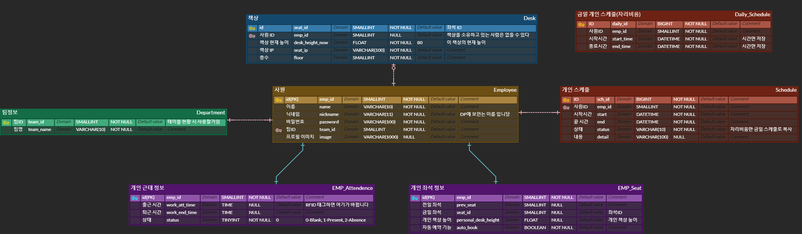

# 주제
- 현명한 직장인의 자리

# 기능 명세서
| | | | | | |
|-|-|-|-|-|-|
|구분|주 기능|상세 기능|내용|비고|
|1. 로그인|1.1. 로그인|1.1.1. 최초 로그인|- 자동 로그인이 설정되어있지 않으면 사용자가 직접 아이디 / 비밀번호를 입력하여 로그인합니다.|- 개인정보 암호화 - 관리자 페이지를 통해     초기 Id(사원번호), 비밀번호 할당|
|||1.1.2. 자동 로그인|- 자동 로그인이 설정되어있으면 자동으로 로그인 되고 메인페이지로 넘어갑니다.| |
||1.2. 개인정보 수정|1.2.1. 비밀번호 변경|- 앱에서 개인정보 수정 탭에서 비밀번호를 변경할 수 있습니다| |
|| |1.2.2. 프로필 변경|- 앱에서 개인정보 수정 탭에서 프로필을 변경할 수 있습니다| |
|2. 출퇴근|2.1. 사원증 태그|2.1.1. 출결 확인|- 사원증을 RFID에 태그하면 출결 정보가 업데이트 됩니다| |
| | |2.1.2. 푸쉬 알림|- 사원증을 RFID에 태그하면 사용자 스마트폰에 푸쉬 알림이 갑니다. (좌석 선택)| |
| |2.2. 퇴근|2.2.1. 퇴근 시간 푸쉬 알림|- 퇴근 예정 시간이 되면 푸쉬 알림으로 퇴근 여부를 알립니다.| |
| | |2.2.2. 퇴근 처리|- 모바일에서 퇴근 버튼을 누르면 퇴근 처리 됩니다|퇴근처리 후 좌석 세팅 / 자리현황 초기화|
|3. 좌석|3.1. 좌석 선택|3.1.1. 좌석 선택하기|- 모바일 앱에서 출근 후, 좌석을 예약할 수 있습니다| |
| | |3.1.2. 좌석 변경하기|- 출근 전 / 후로 예약 좌석을 변경할 수 있습니다| |
| | |3.1.3. 최근 좌석 자동 예약하기|- 전일좌석이 비어있으면 출석 후 앱 실행 시 전일 좌석이 선택되고 3초간 | |
| | |3.1.4. 최근 좌석 자동 예약 기능 ON/OFF|- 앱에서 개인정보 수정 탭에서 전일 좌석 추천 시스템을 ON/OFF할 수 있습니다| |
||3.2. 좌석 조회|3.2.1. 좌석 예약 현황 보기|- 모바일 앱에서 좌석 예약 현황을 조회할 수 있습니다| |
|4. 책상|4.1. 높이 조절|4.1.1. 책상 버튼 통해 수동으로 높이 세팅하기|- 책상에 부착된 버튼으로 수동으로 책상의 높낮이를 조절할 수 있습니다| |
|| |4.1.2. 출근시 선호 높이로 자동 세팅하기|- 좌석 예약이 확정되면 자동으로 책상의 높낮이가 조절됩니다| |
| | |4.1.3. 앱 통해 내 선호 높이로 변경하기|- 앱에 저장된 맞춤 높이로 설정을 누르면 책상의 높낮이가 자동으로 조절됩니다| |
|| |4.1.4. 현재 책상 높이를 개인 선호 높이로 저장하기|- 현재 책상높이를 개인 맞춤 높이로 설정할 수 있습니다| |
|| |4.1.5. 새벽에 책상 높이 Default로 초기화하기|- 새벽 3시가 되면 모든 책상의 높이가 초깃값으로 재설정되어 자동으로 높이가 조절됩니다| |
|5. 스케줄|5.1.일정 관리|5.1.1. 일정 등록하기|- 시간 날짜 설정, 일정명, 일정 내용, 자리 비움 유무, 장소| |
| | |5.1.2. 일정 조회하기|- 모바일의 일정 탭에서 일정을 확인할 수 있습니다| |
| | |5.1.3. 일정 수정하기|- 모바일의 일정 탭에서 일정을 선택하면 수정이 가능합니다| |
| | |5.1.4. 일정 삭제하기|- 모바일의 일정 탭에서 일정을 선택하면 삭제도 가능합니다| |
| 6. Display|6.1. e-paper|6.1.1. 이름 정보 표기|- 좌석 예약이 완료되면 DP에 예약자 이름이 표시됩니다.| |
| | |6.1.2. 팀 정보 표기|- 좌석 예약이 완료되면 DP에 예약자의 소속이 표시됩니다.| |
| | |6.1.3. 현재 상태 표기|- 좌석 예약이 완료되면 예약자 어플에 등록된 개인 일정에 따라 상태가 업데이트 됩니다|- Present / Absence|
|| |6.1.4. 책상 높이 표기|- 좌석 예약이 완료되면 책상의 높낮이가 자동으로 조절되고 DP에 책상 높이가 표시됩니다| |

# ERD
